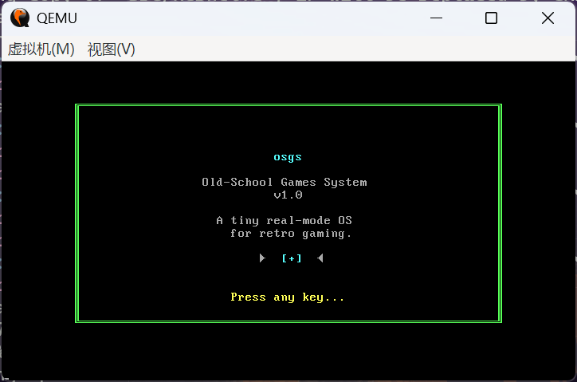
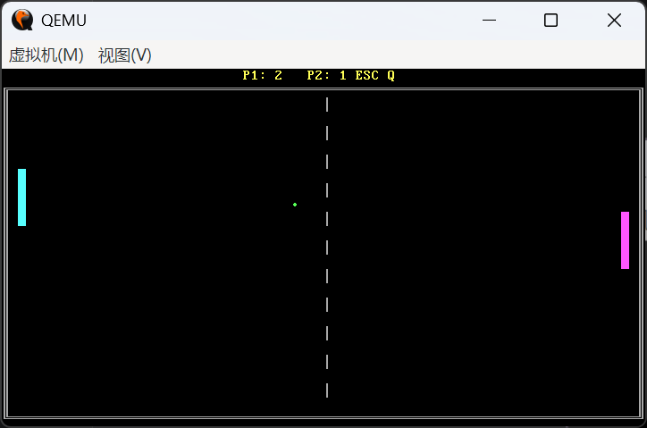

# osgs — Old-School Games System

A tiny real-mode x86 operating system for retro gaming. Boots from a floppy image, runs a shell, and plays Pong.

## Screenshots





## Building

Requires [OpenWatcom v2](https://github.com/open-watcom/open-watcom-v2), [NASM](https://www.nasm.us/), [Python 3](https://www.python.org/), and [QEMU](https://www.qemu.org/).

```powershell
# Build kernel + disk image
python build.py img

# Build and run in QEMU
python build.py run

# Clean build artifacts
python build.py clean
```

## Project Structure

```
osgs/
├── build.py              Build script (compile + link + image)
├── src/
│   ├── boot.asm          Boot sector (512 bytes)
│   ├── entry.asm         Kernel entry (segment setup, call kmain)
│   ├── kernel.c          Splash screen + shell launch
│   ├── vga.c             VGA text mode driver (direct VRAM)
│   ├── keyboard.c        Keyboard input (BIOS INT 16h)
│   ├── shell.c           Command-line interpreter
│   ├── system.c          System utilities (BIOS timer)
│   ├── game.c            Game manager (registry + launcher)
│   └── games/
│       └── pong.c        Pong (2-player, W/S + Up/Down)
└── include/              Header files
```

## Shell Commands

| Command  | Description              |
|----------|--------------------------|
| `help`   | Show available commands  |
| `cls`    | Clear the screen         |
| `list`   | List available games     |
| `run`    | Run a game (`run pong`)  |
| `about`  | About this system        |
| `reboot` | Reboot the system        |

## Tech Stack

- **Language**: C89 + NASM assembly
- **Compiler**: OpenWatcom C (small memory model, 16-bit real mode)
- **Target**: x86 real mode, 1.44MB floppy image
- **Emulator**: QEMU (`qemu-system-i386`)

## License

MIT
